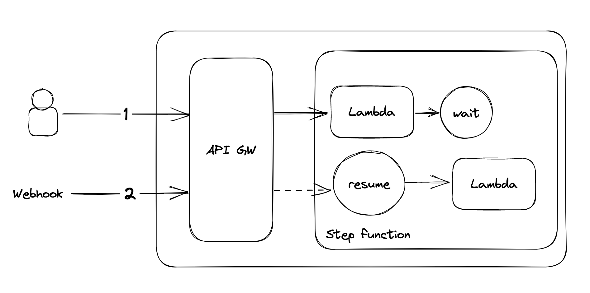

# Intro

Orchestration pattern application using AWS SAM framework. The particularity is the ability to stop the execution of the step function to wait for an incoming webhook.

# Getting Started

To create `sam build && sam deploy`

To get the curl requests
aws cloudformation describe-stacks --region eu-west-1 --stack-name sam-app --query "Stacks[0].Outputs[*].[OutputValue]" --output text
