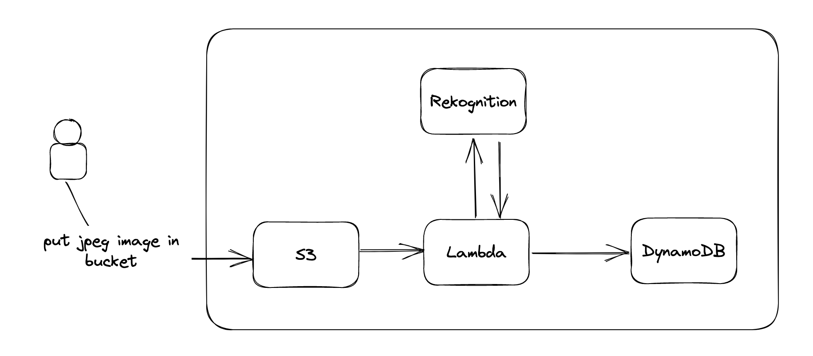

# Intro

Serverless application using AWS SAM framework that uses machine learning and computer vision to recognize images.

The user will upload an image to an S3 bucket, a lambda will analyze the image using AWS Rekognition, and store the result in DynamoDB.

# Getting Started

To create `sam build && sam deploy --parameter-overrides BucketName=monbucketamoiantoineleguern`
