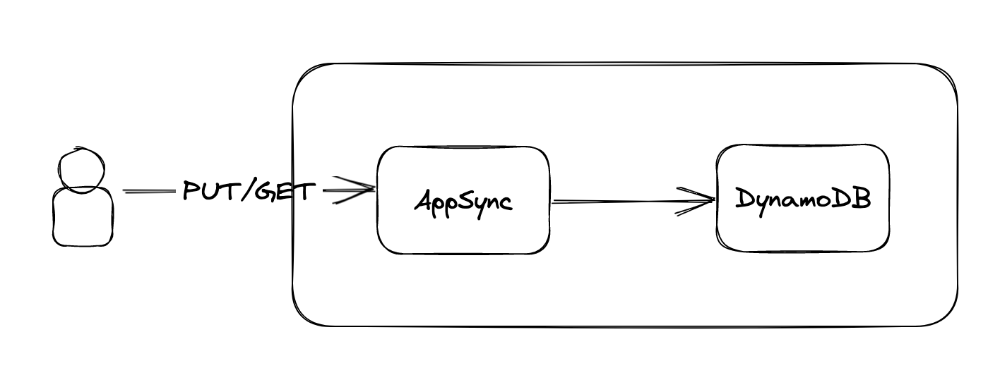

# Intro

Serverless application using AWS SAM framework that creates a graphQL application to write and read a dynamoDB table with the ability to subscribe to data change.

# Getting Started

To create `sam build && sam deploy`
